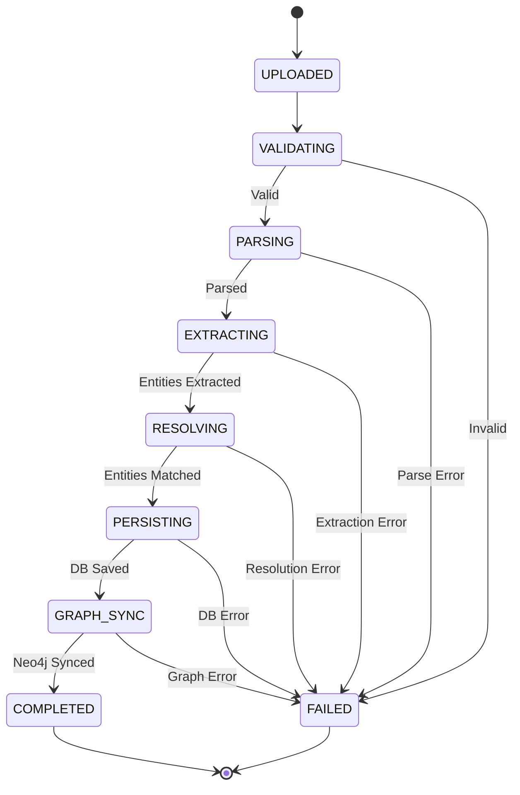
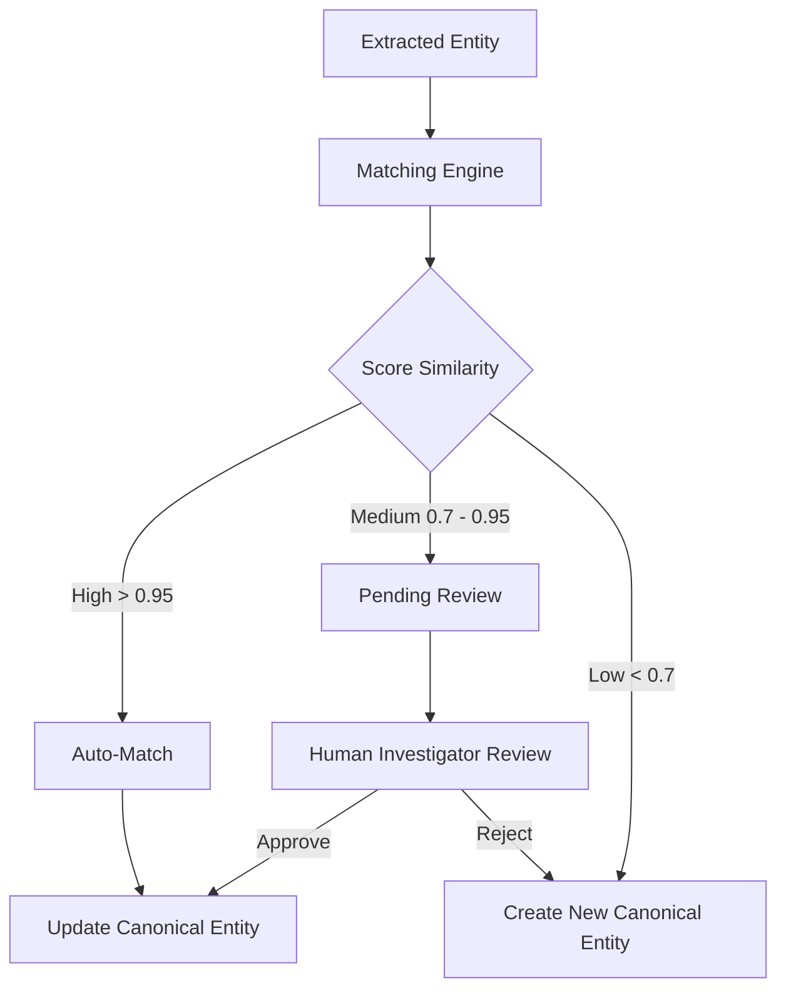

# SIH26189 Data Architecture

## 1. Overview
The SIH26189 Criminal Intelligence Platform utilizes a polyglot persistence architecture designed to support transactional rigor, complex network analysis, and AI-driven operations.

- **PostgreSQL**: System of Record (SoR). Handles all transactional data, user management, structured crime records, and authoritative state. Includes **pgvector** for vector embeddings to support Retrieval-Augmented Generation (RAG).
- **Neo4j**: Graph Projection. Used for relationship traversal, network analysis, and discovering hidden connections between entities. Derived entirely from PostgreSQL data.
- **Redis**: Caching layer (currently unimplemented/placeholder). Planned for session management, rate limiting, and frequent query caching.

## 2. Existing PostgreSQL Schema
The current schema consists of 31 tables grouped by domain. All models inherit from a common `BaseModel` that provides:
- UUID Primary Key
- `TimestampMixin`: `created_at`, `updated_at`
- `SoftDeleteMixin`: `is_deleted`, `deleted_at`
- `AuditMixin`: `created_by`, `updated_by`

### Identity
- `users`: Core user accounts and credentials.
- `roles`: Defined system roles (e.g., Admin, Investigator).
- `permissions`: Granular system permissions.
- `role_permissions`: Mapping of roles to permissions.

### Location
- `districts`: Administrative districts.
- `police_stations`: Specific police station locations and jurisdictions.

### Crime Core
- `crimes`: Primary case/crime records.
- `crime_types`: Categorization of crimes.
- `crime_status_history`: Audit trail of crime status changes.

### Entities
Defined primarily in `backend/app/models/entities.py`.
- `suspects`: Identified suspects.
- `victims`: Identified victims.
- `vehicles`: Involved vehicles.
- `evidence`: Physical or digital evidence associated with crimes.
- `suspect_crimes`: Junction table linking suspects to crimes.
- `victim_crimes`: Junction table linking victims to crimes.
- `crime_vehicles`: Junction table linking vehicles to crimes.

### Investigations
- `investigations`: Investigation records tied to crimes.
- `investigation_notes`: Time-stamped notes added by investigators.

### AI/Analytics
- `ai_conversations`: Chat sessions with the AI assistant.
- `ai_messages`: Individual messages within an AI conversation.
- `ai_query_logs`: Audit of queries executed by the AI.
- `crime_predictions`: Stored outputs from predictive heuristics (rule-based).
- `hotspot_analysis`: Stored hotspot boundary definitions and risk scores.
- `reports`: Generated intelligence reports.

### Operations
- `alerts`: System or AI-generated alerts.
- `officer_assignments`: Mapping of officers to cases/tasks.
- `officer_actions`: Logged actions taken by officers.

### Audit
- `audit_logs`: General system audit logs.
- `notifications`: User notifications.
- `event_audit_log`: Detailed granular event tracking.

### Documents
- `document_chunks`: Stores parsed text chunks and `pgvector` Vector(384) embeddings for RAG.

## 3. Future Canonical Entity Model
To support advanced intelligence operations, the system will migrate towards a universal canonical entity model.

- **Person**: Extends and maps to existing `suspects` + `victims`.
- **Organization**: [NEW] Criminal syndicates, companies, NGOs.
- **Location**: Extends existing `districts` + `police_stations` + geospatial crime coordinates.
- **Vehicle**: Extends existing `vehicles`.
- **Phone**: [NEW] Currently a simple field on `suspects`; needs to be a first-class entity for CDR analysis.
- **Case**: Maps to existing `crimes` + `investigations`.
- **Crime**: Maps to existing `crime_types`.
- **Event**: [NEW] Meetings, border crossings, incidents.
- **FinancialAccount**: [NEW] Bank accounts, crypto wallets.
- **Document**: Extends existing `document_chunks`.
- **Communication**: [NEW] Phone calls, emails, messages.
- **Transaction**: [NEW] Financial transfers, property sales.

## 4. Relationship Model
Target relationships to be established in the graph and relational schema:

- `INVOLVED_IN` (Existing in Neo4j)
- `ASSOCIATED_WITH` (Existing in Neo4j)
- `USES` (e.g., Person -> Phone, Person -> Vehicle)
- `OWNS` (e.g., Person -> FinancialAccount)
- `LOCATED_AT` (e.g., Event -> Location)
- `WORKS_FOR` (e.g., Person -> Organization)
- `CONNECTED_TO` (e.g., Person -> Person)
- `MENTIONED_IN` (e.g., Entity -> Document)
- `OCCURRED_AT` (e.g., Crime -> Location)
- `TRANSFERRED_TO` (e.g., Transaction -> FinancialAccount)
- `CONTACTED` (e.g., Phone -> Phone)
- `PARTICIPATED_IN` (e.g., Person -> Event)

## 5. Future PostgreSQL Tables

To support the AI ingestion and entity resolution pipelines, the following schemas will be introduced:

```sql
CREATE TABLE ingestion_jobs (
    id UUID PRIMARY KEY,
    file_name VARCHAR,
    file_type VARCHAR,
    file_size BIGINT,
    source_type VARCHAR,
    status VARCHAR, -- UPLOADED, VALIDATING, PARSING, EXTRACTING, RESOLVING, PERSISTING, GRAPH_SYNC, COMPLETED, FAILED
    uploaded_by UUID REFERENCES users(id),
    error_message TEXT,
    metadata_json JSONB,
    started_at TIMESTAMP,
    completed_at TIMESTAMP
);

CREATE TABLE extracted_entities (
    id UUID PRIMARY KEY,
    ingestion_job_id UUID REFERENCES ingestion_jobs(id),
    entity_type VARCHAR,
    raw_text TEXT,
    normalized_value TEXT,
    confidence FLOAT,
    source_document_id UUID,
    page_number INT,
    char_start INT,
    char_end INT,
    metadata_json JSONB
);

CREATE TABLE canonical_entities (
    id UUID PRIMARY KEY,
    entity_type VARCHAR,
    canonical_name VARCHAR,
    attributes_json JSONB,
    created_from UUID REFERENCES extracted_entities(id),
    merge_count INT DEFAULT 0
);

CREATE TABLE entity_merges (
    id UUID PRIMARY KEY,
    canonical_entity_id UUID REFERENCES canonical_entities(id),
    extracted_entity_id UUID REFERENCES extracted_entities(id),
    similarity_score FLOAT,
    merge_signals_json JSONB,
    status VARCHAR, -- PENDING_REVIEW, MATCHED, REJECTED, CREATED_NEW
    reviewed_by UUID REFERENCES users(id),
    reviewed_at TIMESTAMP
);

CREATE TABLE evidence_references (
    id UUID PRIMARY KEY,
    source_type VARCHAR, -- DOCUMENT, DATABASE, GRAPH, ANALYSIS
    source_id UUID,
    target_type VARCHAR,
    target_id UUID,
    confidence_level VARCHAR, -- CONFIRMED, INFERRED, PREDICTED
    page_number INT,
    excerpt TEXT,
    metadata_json JSONB
);

-- Extension to document_chunks
ALTER TABLE document_chunks
ADD COLUMN crime_id UUID REFERENCES crimes(id),
ADD COLUMN chunk_page INT,
ADD COLUMN char_start INT,
ADD COLUMN char_end INT;
```

## 6. Neo4j Graph Schema
Neo4j serves purely as a graph projection. Currently, synchronization is a manual process via `build_graph.py`.

- **Current Labels**: `:Person`, `:Crime`, `:Vehicle`, `:Location`.
- **Future Labels**: `:Organization`, `:Phone`, `:Event`, `:FinancialAccount`, `:Communication`, `:Transaction`.
- **Sync Mechanism**: Moving forward, the sync will be automated. A unified pipeline will ingest canonical entities and relations from PostgreSQL and upsert them into Neo4j via an asynchronous queue or change data capture (CDC).

## 7. Evidence Provenance Model
Evidence provenance ensures that every insight, relationship, and entity generated by AI or analytical processes can be traced back to its root source.
- Every canonical entity holds a reference to the `extracted_entities` it was formed from.
- Every `extracted_entity` maps precisely to a `source_document_id`, `page_number`, `char_start`, and `char_end`.
- The `evidence_references` table acts as a global ledger for assertions, mapping analytical targets (like an inferred relationship) back to source documents or database records.

## 8. Ingestion Lifecycle



## 9. Entity Resolution Workflow



## 10. Data Integrity Rules
1. **PostgreSQL is Authoritative**: All system state, configurations, and core entity truths reside in PostgreSQL.
2. **Neo4j is Derived**: No data is written directly to Neo4j by user actions without first passing through and being persisted in PostgreSQL. Neo4j is a secondary projection for query performance.
3. **Immutable Evidence Chains**: Once an extracted entity is linked to a source document, that link cannot be silently broken. If a document is deleted, the entities must either be re-resolved or appropriately tombstoned.
4. **Soft Deletes**: Data is rarely hard-deleted. `SoftDeleteMixin` ensures historical traceability and recovery.
