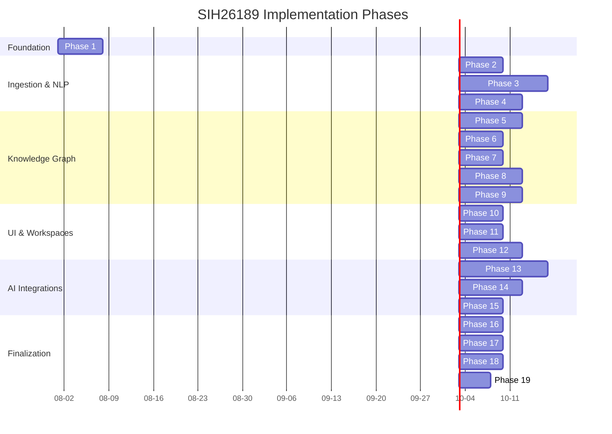

# SIH26189 Phase Map
> **STATUS:** TARGET ARCHITECTURE ROADMAP

This document outlines the 19-phase implementation roadmap for the SIH26189 Criminal Intelligence Platform.

## Dependency Diagram

---

## 1. Foundation + Security + State Agnostic
- **Objective:** Establish the base architecture, remove hardcoded state-specific branding, and secure the baseline application.
- **Key Deliverables:** 
  - JWT integration across all frontend calls.
  - Role-based access control on all endpoints.
  - Removal of hardcoded branding (KCIA/KSP).
- **Dependencies:** None
- **Estimated Complexity:** MEDIUM

## 2. Data Ingestion
- **Objective:** Build robust file upload and queue management for documents.
- **Key Deliverables:**
  - Multipart upload API.
  - Asynchronous background job queue (e.g., Celery/Redis).
  - Tracking of job states (UPLOADED → COMPLETED).
- **Dependencies:** Phase 1
- **Estimated Complexity:** LOW

## 3. Real NLP
- **Objective:** Replace mocked extraction with actual NLP pipelines.
- **Key Deliverables:**
  - NER (Named Entity Recognition) models integration.
  - Extraction of entities (PERSON, LOCATION, etc.).
  - Extraction of relationships between entities.
- **Dependencies:** Phase 2
- **Estimated Complexity:** VERY_HIGH

## 4. Entity Resolution
- **Objective:** Consolidate duplicated entities across disparate documents.
- **Key Deliverables:**
  - Similarity scoring and matching algorithms.
  - API for analysts to review, merge, or reject candidate matches.
- **Dependencies:** Phase 3
- **Estimated Complexity:** HIGH

## 5. Knowledge Graph
- **Objective:** Establish proper persistence and synchronization of graph data.
- **Key Deliverables:**
  - Automated sync from PostgreSQL to Neo4j.
  - Basic node and edge querying APIs.
- **Dependencies:** Phase 4
- **Estimated Complexity:** HIGH

## 6. Graph Analytics
- **Objective:** Compute basic metrics on the graph structure.
- **Key Deliverables:**
  - Centrality metrics (Degree, Betweenness, PageRank).
  - Shortest path algorithms.
- **Dependencies:** Phase 5
- **Estimated Complexity:** MEDIUM

## 7. Community Detection
- **Objective:** Identify hidden clusters and syndicates within the network.
- **Key Deliverables:**
  - Integration of algorithms like Louvain or Label Propagation.
  - API to retrieve community structures.
- **Dependencies:** Phase 6
- **Estimated Complexity:** MEDIUM

## 8. Anomaly Detection
- **Objective:** Automatically flag suspicious patterns and outliers.
- **Key Deliverables:**
  - Rule-based and statistical detection of financial, temporal, and network anomalies.
  - Alerting mechanism.
- **Dependencies:** Phase 6
- **Estimated Complexity:** HIGH

## 9. Link Prediction
- **Objective:** Predict non-obvious hidden connections between entities.
- **Key Deliverables:**
  - Heuristics or ML models for link prediction.
  - API exposing predicted relationships with confidence scores.
- **Dependencies:** Phase 8
- **Estimated Complexity:** VERY_HIGH

## 10. Evidence/Explainability
- **Objective:** Ensure every insight can be traced back to original source data.
- **Key Deliverables:**
  - Provenance tracking schema.
  - APIs to fetch evidence chains for nodes, edges, and anomalies.
- **Dependencies:** Phase 9
- **Estimated Complexity:** MEDIUM

## 11. Crime Map
- **Objective:** Geospatial visualization of intelligence.
- **Key Deliverables:**
  - Map UI component.
  - Geospatial querying of entities and events.
- **Dependencies:** Phase 10
- **Estimated Complexity:** MEDIUM

## 12. Investigation Workspace
- **Objective:** Provide a centralized dashboard for analysts to track cases.
- **Key Deliverables:**
  - Canvas for saving nodes, notes, and evidence.
  - Collaboration features.
- **Dependencies:** Phase 11
- **Estimated Complexity:** HIGH

## 13. AI Copilot
- **Objective:** Implement a conversational assistant for graph and document queries.
- **Key Deliverables:**
  - Intent detection engine.
  - Tool execution framework (SQL, Cypher, RAG).
- **Dependencies:** Phase 12
- **Estimated Complexity:** HIGH

## 14. Evidence-Grounded AI
- **Objective:** Prevent AI hallucinations by enforcing strict evidence constraints.
- **Key Deliverables:**
  - Validation steps in the LLM pipeline.
  - Citation injection in Copilot responses.
- **Dependencies:** Phase 13
- **Estimated Complexity:** HIGH

## 15. Reports
- **Objective:** Generate comprehensive dossiers and case summaries.
- **Key Deliverables:**
  - PDF/Word export functionality.
  - Automated narrative generation.
- **Dependencies:** Phase 14
- **Estimated Complexity:** LOW

## 16. Security Hardening
- **Objective:** Prepare the application for production deployment constraints.
- **Key Deliverables:**
  - Rate limiting, audit logging.
  - Input sanitization and dependency scanning.
- **Dependencies:** Phase 15
- **Estimated Complexity:** MEDIUM

## 17. Testing
- **Objective:** Ensure system reliability and correctness.
- **Key Deliverables:**
  - Unit tests, integration tests.
  - Performance profiling.
- **Dependencies:** Phase 16
- **Estimated Complexity:** MEDIUM

## 18. Synthetic SIH Dataset
- **Objective:** Create a realistic, privacy-safe dataset for demonstration.
- **Key Deliverables:**
  - Generators for FIRs, call logs, and bank statements.
  - Ingestion of synthetic data into the system.
- **Dependencies:** Phase 17
- **Estimated Complexity:** HIGH

## 19. SIH Demonstration Story
- **Objective:** Finalize the pitch and walkthrough for the hackathon.
- **Key Deliverables:**
  - Curated investigation scenario.
  - Pre-cached complex queries to ensure demo stability.
- **Dependencies:** Phase 18
- **Estimated Complexity:** LOW
